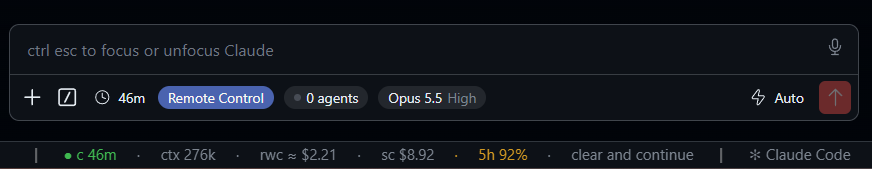

# Claude Status

The [cache-status](../../mods/cache-status) band for VS Code. Claude Code mods cannot draw above the prompt in the VS Code chat, so this extension shows the same values in the VS Code status bar.

> [!IMPORTANT]
> This extension does nothing on its own. It has no data source of its own and only shows what the **cache-status mod** writes. Installed without the mod, the status bar stays empty. Install the mod first (see [Requirements](#requirements)). Claude Desktop is not needed: the mod runs inside the Claude Code process that the VS Code chat starts.



*The status bar under the VS Code chat: cache warm for 46 minutes, 276k tokens in context, a cold rewrite would cost about $2.21, the session cost $8.92 so far, the 5-hour plan limit at 92 %, and the handoff button ready to clear and continue.*

## The status bar

`┃ ● c 42m · ctx 184k · rwc ≈ $1.20 · sc $3.31 · 5h 40% · w 24% · handoff ┃`

| Part | Meaning |
| --- | --- |
| `c 42m` | Prompt cache state and minutes until it expires. Green while warm, yellow 5 minutes before expiry, cyan while kept warm, red once cold on a big context, dim when cold on a small one. |
| `ctx` | Tokens in context. |
| `rwc` | Rewrite cost: what writing the context into the cache again would cost if it expires. Red together with a cold big cache. |
| `sc` | Session cost so far, at API list prices. |
| `5h`, `w` | 5-hour and weekly plan limits used. Yellow at 80 %, red at 95 %. |

Only the part that needs attention takes a colour, as in the band. The section sits left of every other item on the right side of the status bar, between two dim bars, so it does not run into the items of other extensions.

Plan limits belong to the account, not to one chat. The extension shows the highest value of the current window across all live chats, so a chat you just reopened shows the limits before its first turn ends.

At the end sits the band's handoff button. It shows `handoff`, then `handoff queued` and `handoff running` while the session-handoff skill runs, then `clear and continue` once the handoff is ready, and `clearing` while the chat clears. Click `handoff` or `clear and continue` to run that step in the chat, as the band buttons do. The click writes a command file to `~/.claude/mods-data/cache-status/commands/`. The mod picks it up within 2 seconds.

Hover a part for the explanations. Click it, or run **Claude Status: Show All Sessions**, for every live Claude Code session on this machine, in /board order.

## Requirements

- The cache-status mod, at a version that writes live files (`~/.claude/mods-data/cache-status/live/`). Install it in Claude Code:

  ```
  /plugin marketplace add IT-BAER/claude-forge
  /plugin install cache-status@claude-forge
  ```

  Update it with `/plugin marketplace update claude-forge`. A mod install or update reaches a chat only after you restart that chat.
- The status bar shows the session whose working directory is a folder of this VS Code window. A session started from the VS Code extension wins over a terminal or Desktop session in the same folder.

## Install

Install the cache-status mod first (see [Requirements](#requirements)). There is no Marketplace listing. Build and install the .vsix:

```
cd extensions/claude-status
npx @vscode/vsce package
code --install-extension claude-status-0.2.8.vsix
```

Then run **Developer: Reload Window**.

## How it works

The mod writes one JSON file per session on each heartbeat (about every 30 seconds, and after every turn). The extension reads that folder every 2 seconds. Files of ended sessions, and files older than 60 minutes, are ignored. Nothing leaves your machine.

## License

MIT. See [LICENSE](LICENSE).
