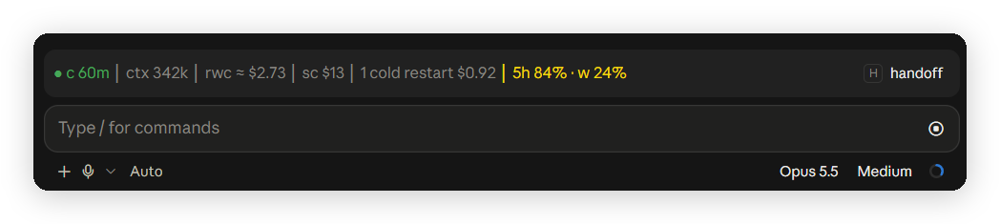

# cache-status

A compact prompt-cache status band for Claude Code, with a cold-send guard, keep-warm, a board of all local chats, and handoffs to a fresh chat.

This is a fork of **Cache Keeper** by Nate Herk ([nateherkai/claude-code-mods](https://github.com/nateherkai/claude-code-mods)), MIT licensed. The cache logic, board, guard and handoff flow are his work. See [Changes from Cache Keeper](#changes-from-cache-keeper) for what this fork adds.



*The band above the prompt: cache warm for 60 minutes, 342k tokens in context, a cold rewrite would cost about $2.73, the session cost $13 so far, and the 5-hour and weekly plan limits.*

## Why

Every request re-reads the whole chat. From the prompt cache that costs a tenth of the normal input price. Once the cache expires (5 minutes or 1 hour idle, depending on your plan), the next message writes the whole chat into the cache again at up to 2x the input price. On a large chat that one message can cost a few dollars.

## Requirements

- Claude Code 2.1.287 or later, in the terminal or the Desktop app's Code tab. The VS Code chat does not draw the band; the [claude-status](../../extensions/claude-status) extension shows the same values in the VS Code status bar.
- Mods turned on for your account. `claude plugin test` in any folder answers "no hooks module to load" when mods can load.
- Do not install it next to Cache Keeper. Both register the same commands.

## Install

```
/plugin marketplace add IT-BAER/claude-forge
/plugin install cache-status@claude-forge
```

Start a new session afterwards.

## The band

`● c 60m │ ctx 342k │ rwc ≈ $2.73 │ sc $13 │ 5h 84% · w 24%`

| Part | Meaning |
| --- | --- |
| `c 60m` | Prompt cache state and minutes until it expires. Yellow 5 minutes before expiry, red once cold. |
| `ctx` | Tokens in context. |
| `rwc` | Rewrite cost: what writing the context into the cache again would cost if it expires. |
| `sc` | Session cost so far, at API list prices. |
| `5h`, `w` | 5-hour and weekly plan limits used. Yellow at 80 %, red at 95 %. |

Hover `c`, `rwc` or `sc` for a one-line explanation above the band. On a subscription the prices show up as usage against your limits, not as a bill.

## Commands

- `/keepwarm [hours|off]` keeps this chat's cache warm, 4 hours by default, with a small ping shortly before it would expire.
- Cold-send guard: a message into a chat over 150k tokens after its cache expired asks first: Send anyway, Compact first, or Cancel.
- `/board` shows every local chat in one pane: waiting on you first, then working, then the ones whose cache cools soonest.
- `/handoff` (or the `handoff` button) runs the bundled `session-handoff` skill, then clears the chat and starts the fresh one from the handoff.
- `/cache` shows status and settings: `ttl 5|60|auto`, `guard on|off`, `big 150k`, `alerts [on|off]`.
- Alerts are off by default. They are the unasked toasts: a big cache about to go cold, and another chat waiting on you. `/cache alerts` toggles them.

## Changes from Cache Keeper

- Short band labels (`c`, `rwc`, `sc`, `w`) so the band fits next to the prompt, session cost before the plan limits.
- Hover help for the short labels. The help row opens above the band, so the hovered text does not move.
- Handoff files: when Claude writes a `session-handoff.md`, a `restart-packet.md` (also with a suffix, like `session-handoff-pve.md`) or a file under `handoffs/`, the band offers to clear and continue from that file. Any header format works; only a header marked `status: consumed` (or another non-active status) is skipped. If a handoff turn ends on a short answer (a Stop hook added a tail), the last handoff file written in the session is used instead. The fresh chat gets a short "read this file" prompt instead of the whole text.
- Renamed to `cache-status`. Data lives in `~/.claude/mods-data/cache-status/`.

## Where the data lives

Everything stays on your machine, under `~/.claude/mods-data/`. The mod makes no network calls of its own. Keep-warm pings are small model requests, sent only while `/keepwarm` is on.

## License

MIT. See [LICENSE](LICENSE). Original work copyright Nate Herk.
