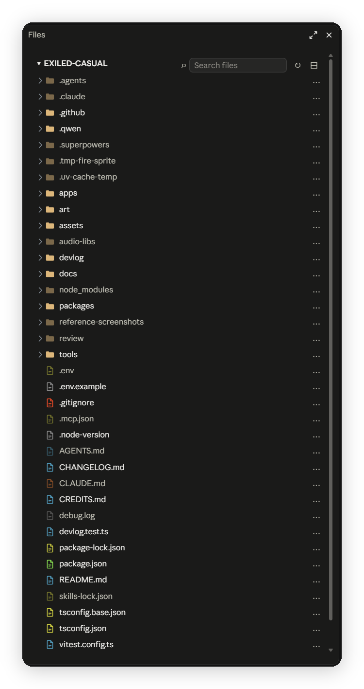
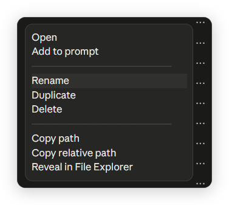
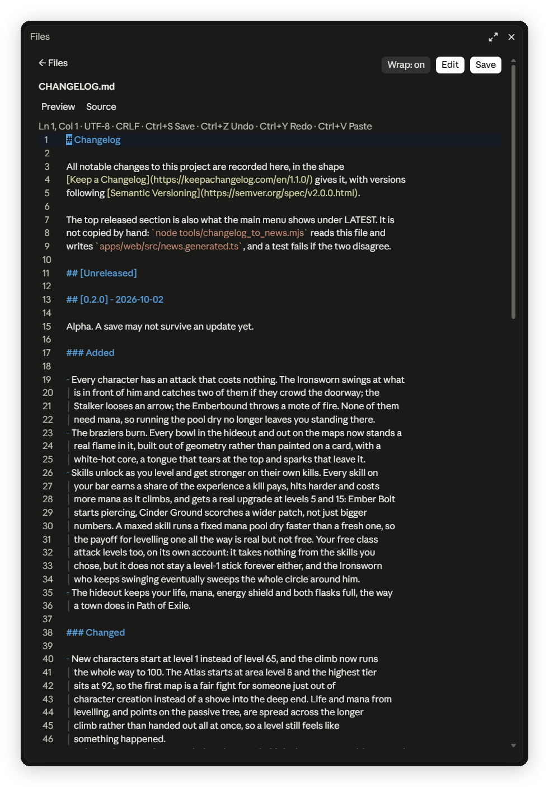

# file-explorer

A VS Code style file explorer for Claude Code. It opens a pane with the file tree of your session's working directory, previews files, and lets you edit and save them without leaving the session.



*The pane on a project folder. Folders come first, ignored entries such as `node_modules` are dimmed, and the search box, refresh and collapse buttons sit at the top.*

## Install

Pick one way. All three need a new Claude Code session afterwards.

### 1. Plugin marketplace (recommended)

Run this in Claude Code:

```
/plugin marketplace add IT-BAER/claude-forge
/plugin install file-explorer@claude-forge
```

Or from a normal terminal:

```bash
claude plugin marketplace add IT-BAER/claude-forge
claude plugin install file-explorer@claude-forge
```

### 2. Copy the folder

```bash
git clone https://github.com/IT-BAER/claude-forge.git
mkdir -p ~/.claude/skills
rm -rf ~/.claude/skills/file-explorer
cp -r claude-forge/mods/file-explorer ~/.claude/skills/file-explorer
```

PowerShell:

```powershell
git clone https://github.com/IT-BAER/claude-forge.git
Remove-Item "$HOME\.claude\skills\file-explorer" -Recurse -Force -ErrorAction SilentlyContinue
Copy-Item claude-forge\mods\file-explorer "$HOME\.claude\skills\file-explorer" -Recurse
```

Claude Code loads any plugin folder inside `~/.claude/skills/` at the next session start. The first command line removes an older copy, so run the pair again to update. Without it, a second copy ends up inside the first.

### 3. Try it for one session

```bash
claude --plugin-dir path/to/claude-forge/mods/file-explorer
```

## Use it

Type `/files` to open the pane. Type it again to close it.

| Command | What it does |
| --- | --- |
| `/files` | Open or close the pane |
| `/files on` | Open the pane at every session start |
| `/files off` | Stop opening it at session start |
| `/files <path>` | Show another folder instead of the working directory |
| `/files reset` | Go back to the working directory |

## Requirements

- Claude Code 2.1.x with the mod API, in the desktop app (Code tab) or the terminal.
- Windows. The preview, save and image scripts run with `powershell.exe`.
- `git` on the PATH for git status colours (optional).

## Features

### File tree

- Folders open and close with a click. Git status shows as a coloured letter: M modified, U untracked, A added, R renamed, D deleted. Ignored files are dimmed.
- The search box matches file and folder names in all subfolders, also collapsed ones. Each result shows its parent folder. It skips `.git` and `node_modules` and stops at 20,000 entries.
- Hover the icons at the top right: refresh the tree, or collapse all folders.
- Click a file to select it. Double-click opens the preview. Ctrl+click adds an `@path` mention to your prompt.
- Click the … at the end of a row for a popup menu (a click outside the pane hides it): Open, Add to prompt, Rename, Duplicate, Delete (to the Recycle Bin, after a confirm), Copy path, Copy relative path, Reveal in File Explorer. Folders also offer New file and New folder.



*The … menu of a row. Open and Add to prompt come first, then Rename, Duplicate and Delete, then the copy and reveal actions.*

### Preview

- Markdown files render with headings, tables, links and code blocks. A Source button shows the raw text with syntax colours.
- PNG, JPG, GIF and BMP images (up to 20 MiB) are scaled to fit the pane.
- Text files up to 2 MiB open. Binary files show a short notice instead.

### Editor



*Editing `CHANGELOG.md`. The status line shows the caret position, encoding and line ending. Headings, links and inline code have their own colours, and wrapped list lines keep an indent guide.*

Press Edit in the preview. Changes stay a draft until you press Save or Ctrl+S. Back asks before it discards a draft. If the file changed on disk in the meantime, the save is refused and your draft stays.

- Encoding (UTF-8, UTF-8 with BOM, UTF-16) and line endings are kept as they were.
- Syntax colours for TypeScript, JavaScript, C-like languages, Python, PowerShell, shell, JSON, YAML, TOML, SQL, CSS, HTML and Markdown (with fenced code in its own language).
- Soft wrap is on for Markdown and text files, off for code. The Wrap button switches it.
- The bracket next to the caret and its partner are highlighted. Leading indentation shows guides, trailing spaces and tabs show as dim marks.
- Files over 30,000 characters, with mixed line endings or with control characters open read-only.

| Keys | Action |
| --- | --- |
| Ctrl+S | Save |
| Ctrl+Z, Ctrl+Y | Undo, redo |
| Ctrl+A, Ctrl+C, Ctrl+X, Ctrl+V | Select all, copy, cut, paste |
| Ctrl+Left, Ctrl+Right | Move by word |
| Ctrl+Backspace, Ctrl+Delete | Delete a word |
| Ctrl+D, Ctrl+K, Ctrl+L | Duplicate, delete, select the line |
| Ctrl+/ | Comment or uncomment the selected lines |
| Tab, Shift+Tab | Indent, outdent the selected lines |
| Home | First non-blank character, then column 0 |
| Double-click, triple-click | Select a word, a line |

### Find and replace

Ctrl+F finds as you type and marks every match. Ctrl+H adds a replace field. The bar shows in the status line under the prompt.

| Keys | Action |
| --- | --- |
| Enter, Shift+Enter | Next, previous match |
| Tab | Switch between the find and replace field (Ctrl+H) |
| Enter in the replace field | Replace this match, go to the next |
| Ctrl+Enter | Replace all matches (one undo step) |
| Ctrl+F or Ctrl+H again | Close the bar |

Matching ignores case.

## Settings

None are needed. An optional `theme.json` next to `.claude-plugin/` tunes the look, for example `{ "radius": 4, "bgHover": "#262729", "bgPicked": "#343638", "rowH": 26.5, "searchCells": 22 }`. The pane picks up changes within a few seconds.

## Limits

- The tree shows the first 800 rows of the current view.
- Edits are limited to 30,000 characters per file.
- The pane needs Claude Code's mod API, which changes between releases. After an upgrade the mod can need an update.

## License

MIT, see the repository root.
